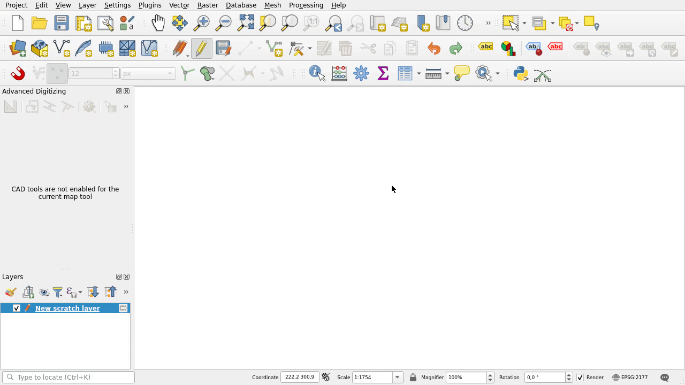

TWO DISTANCES INTERSECTION PLUGIN FOR QGIS APPLICATION

The plugin allows you get the intersection of two distances (2D Cartesian). Launched in the following QGIS versions: 3.34.7, 3.34.11, 3.34.13, 3.40.2.

Note: Since QGIS 3.40 Advanced Digitizing panel has a 2-Circle Point Intersection button menu and plugin installation is not necessary.

Version 1.0.18

