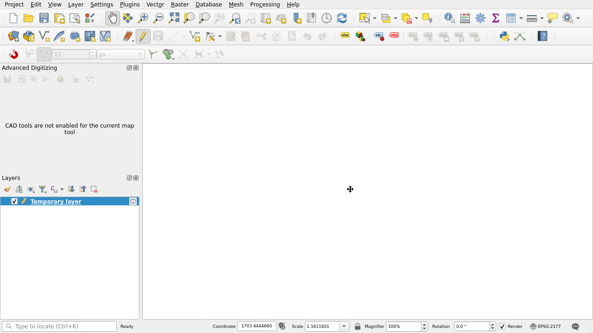

TWO DISTANCES INTERSECTION PLUGIN FOR QGIS APPLICATION

The plugin allows you get the intersection of two distances (2D Cartesian) and is created with QGIS 3.28 application.

It installs one button. This is 2D tool and it does not take Z into account. You can run it by clicking on the button. You indicate two distances like you were drawing circles (a left click then a right click). If they have two intersections you can point one. The intersection (result) is shown depending on the layer geometry. On point layer it will be a point, on line layer two line segments and on polygon layer a triangle. When using the plugin and want to enter distances by numbers, display the Advanced Digitizing panel from Panels in View menu in QGIS.

To install the plugin from github, download the project as a zip file (click button Code, Download ZIP). Run QGIS application. Click the Plugins menu, then Manage and Install Plugins... (wait for a moment here or break fetching list of plugins), next Install from ZIP. Then select the downloaded zip file and click Install Plugin button.

After installing the plugin, help is available in the Help menu, Plugins.

Note: Not all coordinate systems (CRS) allow you to enter a distance in the advanced digitization panel. The tool is useful for working with flat coordinate systems, for example for Poland EPSG:2176, EPSG:2177, EPSG:2178, EPSG:2179.

Version 1.0.14

